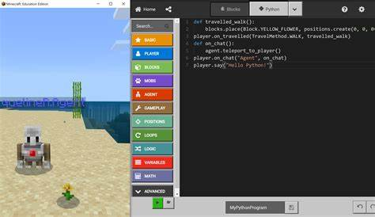

## 🎮 Exercise 1: Say Hello in Minecraft!

### 👋 What You’ll Learn

In this activity, you’ll learn how to:

* Open the **Code Builder** in Minecraft Education.
* Write a simple line of code using **MakeCode Python**.
* Make your character say something in the game chat.

---

### 🧠 What is Code Builder?

Minecraft Education has a special tool called **Code Builder** that lets you write code to do cool things in the game—like build stuff, teleport, or talk!



You’ll write **MakeCode Python** — a super fun version of the Python language made just for Minecraft.

---

### 🪄 Step-by-Step Instructions

#### ✅ Step 1: Open Code Builder

1. Open Minecraft Education.


3. Enter a world or create a new one.


4. Press the **C key** on your keyboard — this opens the **Code Builder**.


5. Choose **MakeCode**, start a New Project and give it a name


6. Then select **Python** from the drop down menu


You are now ready to code in **Python**


---

#### ✅ Step 2: Write Your First Code

In the code editor, delete the existing code, and type this exactly:

```python
player.say("Hello, Minecraft World!")
```

This line tells your player to say something in the game chat. The message is inside the quotes.


---

#### ✅ Step 3: Run Your Code

1. Click the **green Play button** in the corner.
2. Look in the top left of your game screen.
3. You should see your message appear, like magic!


---

### 🧩 Challenge

Try changing the message to something else. Here are some fun ideas:

```python
player.say("I love building!")
player.say("Watch out for creepers!")
player.say("Today is a good day to code!")
```

---

### 📝 What Just Happened?

* `player.say(...)` is a command.
* The words inside the quotes (`"..."`) are what your player says.
* This is called a **string** — just a fancy word for text.

---

### 🧠 Did You Know?

You can make your character say **anything** (as long as it’s inside the quotes). This is how coders give feedback or add fun to their games.

---

### ⭐ Bonus Tip

Try writing more than one line:

```python
player.say("Hi!")
player.say("I'm learning to code!")
```

What happens when you run it?

---
